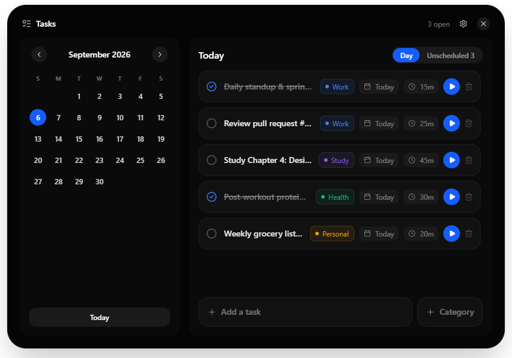
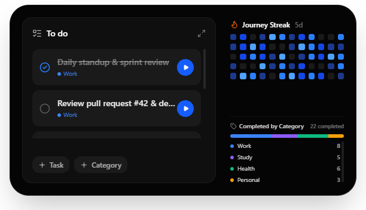

# Daily Note

A minimalist, floating notch-style task manager and focus timer built for desktop. It stays out of your way at the top of your screen, expanding into a full daily planner and category dashboard when you need it.

<div align="center">
  
</div>

---

## Overview

Daily Note is designed around the concept of an ambient desktop notch (inspired by Dynamic Island). Instead of keeping a full-sized productivity app open all day, Daily Note lives as a compact pill that transitions between three states depending on what you're doing:

### Interface States

| State | Description | Preview |
| :--- | :--- | :--- |
| **Collapsed** | 320×120 unobtrusive bar showing the active task, live countdown, and focus progress. |  |
| **Hovered** | 580×320 card showing daily to-dos, 60-day activity heatmap, and category completion chart. |  |
| **Expanded** | 880×640 full workspace with interactive monthly calendar, scheduled day view, unscheduled inbox, category management, and duration controls. |  |

All data is stored locally in SQLite. No accounts, no telemetry, and 100% offline.

---

## Features

- **Ambient Desktop Notch**: Frameless, transparent, always-on-top window with smooth bezier expansion transitions.
- **Focus Timer & Stopwatch**:
  - Countdown timer for scheduled tasks (customizable in 5-minute increments).
  - Stopwatch mode for unscheduled or open-ended tasks.
  - Quick radio-button completion directly from the collapsed pill.
- **Task Organization**:
  - **Day View**: Tasks scheduled for the selected calendar date.
  - **Unscheduled Inbox**: Backlog for capturing ideas and to-dos without a date.
  - **Drag-and-Drop Reordering**: Prioritize tasks by dragging them in the list.
- **Custom Categories**:
  - Create and color-code categories (Work, Study, Health, Personal, or custom routines).
  - Quick category tagging directly from the task list or creation bar.
  - Category completion breakdown bar chart and counts.
- **Activity Heatmap & Streaks**:
  - 60-day visual activity heatmap showing completed task intensity over time.
  - Streak tracking counter to maintain daily momentum.
- **Local-First Storage**:
  - Powered by embedded SQLite (`better-sqlite3`).
  - Instant reads and writes with zero network latency.
- **Global Shortcuts & System Tray**:
  - Toggle timer from anywhere via global hotkeys.
  - System tray integration with quick actions and quit menu.
- **Bilingual**:
  - English and Portuguese (Brasil) localization, switchable on the fly from Settings.

---

## Tech Stack

| Layer | Technology |
| :--- | :--- |
| **Framework** | Electron |
| **UI Library** | React 19 |
| **Language** | TypeScript |
| **Styling** | Tailwind CSS v4 |
| **Build Tool** | Vite (`vite-plugin-electron`, `@vitejs/plugin-react`) |
| **Database** | SQLite (`better-sqlite3`) |
| **Icons** | Lucide React |
| **Testing** | Vitest, React Testing Library |

---

## Getting Started

### Prerequisites

- [Node.js](https://nodejs.org/) (v18 or higher recommended)
- `npm`, `pnpm`, or `yarn`
- C++ build tools (required by `better-sqlite3` native bindings on Windows / macOS / Linux)

### Installation

```bash
# Clone the repository
git clone https://github.com/TheJoaoVitorio/daily-note.git
cd daily-note

# Install dependencies
npm install
```

### Running in Development

```bash
npm run dev
```

This starts the Vite development server with Hot Module Replacement (HMR) and launches the Electron application.

### Building for Production

```bash
# Typecheck and build the renderer and electron bundles
npm run build
```

The output will be generated in `dist/` (web renderer) and `dist-electron/` (main process and preloads).

---

## Project Structure

```
daily-note/
├── src/
│   ├── main/                   # Electron main process
│   │   ├── modules/
│   │   │   ├── shortcuts/      # Global keyboard shortcut registrations
│   │   │   ├── store/          # SQLite database setup, queries, and migrations
│   │   │   ├── timer/          # Timer engine and notification dispatch
│   │   │   └── tray/           # System tray icon and context menu
│   │   └── index.ts            # Window creation, display bounds, and IPC handlers
│   ├── preload/                # Context isolation preloads and IPC bridge
│   │   └── index.ts
│   ├── renderer/               # React frontend
│   │   ├── src/
│   │   │   ├── App.tsx         # Main UI component (Collapsed / Hovered / Expanded)
│   │   │   ├── App.test.tsx    # Component and integration tests
│   │   │   ├── i18n.ts         # English and PT-BR dictionary and translation hook
│   │   │   └── index.css       # Tailwind CSS imports and custom scrollbars
│   │   └── index.html
│   └── shared/
│       └── types.ts            # Shared interfaces (Task, Category, StoreData, etc.)
├── vitest.config.ts            # Test runner configuration
├── vite.config.ts              # Vite + Electron build configuration
└── package.json
```

---

## Keyboard Shortcuts

| Shortcut | Action | Scope |
| :--- | :--- | :--- |
| `Ctrl+Shift+Space` / `Cmd+Shift+Space` | Toggle focus timer (Start / Stop) | Global (system-wide) |
| `Enter` | Save new task in creation form | App focused |
| `Esc` | Close Settings / cancel task creation | App focused |

---

## Testing

Run the Vitest test suite:

```bash
# Run all tests once
npx vitest run

# Run in watch mode
npx vitest
```

---

## License

MIT © [João Vitório](https://github.com/TheJoaoVitorio)

